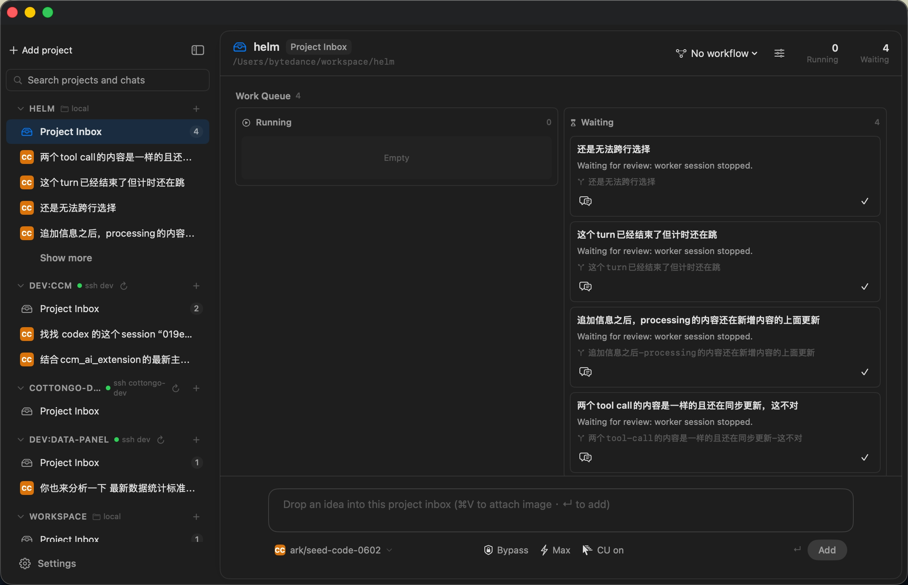

# Helm

Helm is a native macOS client for working with Claude Code and Codex sessions
across local and SSH projects.



It is intentionally a thin SwiftUI shell over the vendor CLIs and SDKs. Agent
transcripts, auth, and config live on the machine running the agent: local
`~/.codex` / `~/.claude` for local projects, or the remote SSH host for remote
projects. Helm keeps only app state, profile metadata, and restorable session
indexes in its own app support directory.

## Status

Pre-1.0 and moving quickly. Expect data shapes, settings, and UI details to
change while the project settles.

## Features

- Single-window macOS UI for local and SSH projects.
- Claude and Codex profiles with separate providers, models, environment
  overlays, and command paths.
- Session creation, resume, rename, archive, and project-level organization.
- Streaming chat rendering with tool calls, approvals, diffs, reasoning blocks,
  image attachments, and Markdown.
- Per-session runtime controls such as model, profile, sandbox, approval mode,
  and reasoning effort.
- Project Inbox workflow support for task orchestration inside Helm.

Helm is not affiliated with Anthropic, OpenAI, or the Kubernetes Helm project.

## Requirements

- macOS 15 or newer.
- Xcode with the macOS SDK installed.
- Git.
- Claude Code and/or Codex installed and authenticated if you want to run those
  providers.

The Xcode project is checked in. `project.yml` is also kept as the source of
truth for regenerating the project when desired.

## Build

```bash
git clone https://github.com/BD777/helm.git
cd helm
xcodebuild -project Helm.xcodeproj \
  -scheme Helm \
  -configuration Debug \
  -derivedDataPath build/DerivedData \
  build
open build/DerivedData/Build/Products/Debug/Helm.app
```

For a local release-style rebuild and install, run:

```bash
./rebuild-helm-app.command
```

That script fetches the configured remote branch, builds a Release app, and
installs it into `/Applications` by default. It may quit a running Helm app
before replacing it.

## Layout

- `Helm/` - SwiftUI app source.
- `Helm.xcodeproj/` - checked-in Xcode project.
- `project.yml` - XcodeGen project definition.
- `design/` - early mockups and UI notes.
- `docs/` - public architecture, development, and privacy notes.
- `.claude/skills/` - optional project workflow skill used by Helm Project
  Inbox integrations.

## Documentation

- [Architecture](docs/architecture.md)
- [Development](docs/development.md)
- [Privacy and Data Handling](docs/privacy.md)
- [Contributing](CONTRIBUTING.md)
- [Security](SECURITY.md)

## License

MIT. See [LICENSE](LICENSE).
